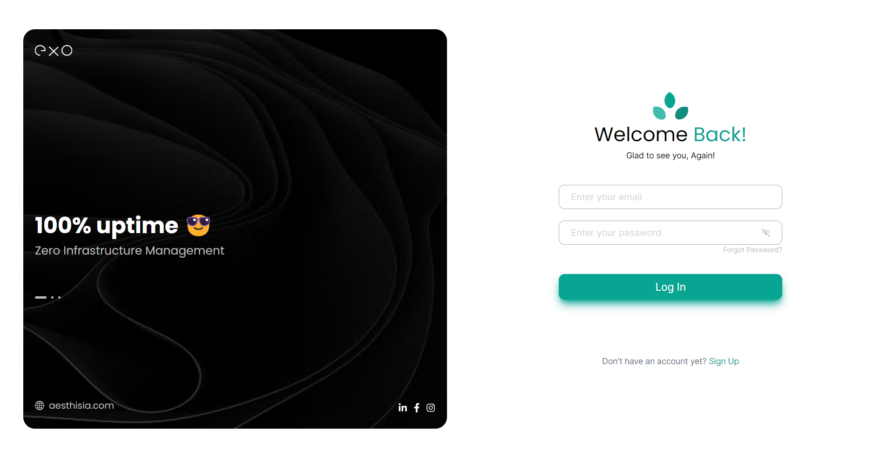

# Exo Login Page

This is an assignment from the [Aesthisia](https://aesthisia.com/). It is a static login page with a carousel of features and login form.

This Page is -
- **responsive to every screen size**
- **Styled with Tailwind CSS utility classes**
- **developed with strongly typed TypeScript**
- **has an automatic carousel**

### Links

- Solution URL: [click here](https://github.com/Sagar969/Aesthisia-assignment)
- Live Site URL: [click here](https://sagar969.github.io/Aesthisia-assignment/)

### Built with

- [React](https://reactjs.org/) - JS library
- [TypeScript](https://www.typescriptlang.org/) - Strongly typed programming language built on JavaScript
- [Tailwind CSS](https://tailwindcss.com/) - Utility-first CSS framework

### Screenshot

#### Desktop View

#### Mobile View

